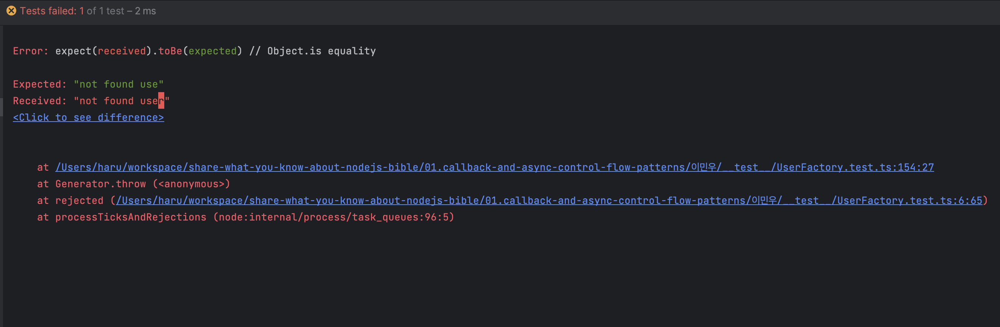
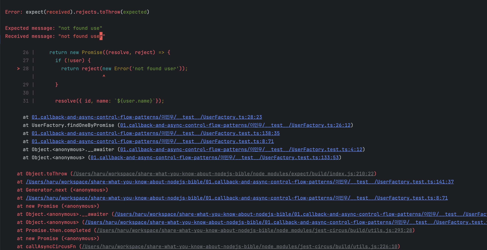

## 배운 내용

- jest에서는 callback, eventEmitter 작업을 테스트하기 위해선 done()함수를 사용하여 비동기 작업이 끝날 때까지 기다려야 한다.

- jest에서는 promise 작업은 async/await 또는 return Promise를 사용하여 비동기 작업이 끝날 때까지 기다려야 한다.
  - 테스트 함수가 return promise를 받을시 해당 promise가 resolve 될 때까지 기다린다.
```ts
it('return Promise로 결과를 처리한다.',   () => {
  // given
  const userId = 1;
  const userFactory = new UserFactory(userId);

  // when
  const result = userFactory.findOneByPromise(userId, 1);

  // then
  return result.then((user: any) => {
    expect(user).toMatchInlineSnapshot(`
      {
        "id": 1,
        "name": "minwoo1",
      }
    `);
  })
});
```

- 발생하는 에러 및 예외 처리에 대한 검증은 아래 두가지 방식으로 처리가 가능하다.
  - try ~ catch 구문으로 처리
  - expect().rejects.toThrow()로 처리 

하지만 try ~ catch 보다는 expect().rejects.toThrow()를 사용하는 것이 더 에러 트레이스를 추적하기에 용이하다.

1. try ~ catch

```ts
it('try catch 통해 결과를 처리한다.',  async () => {
  // given
  const userFactory = new UserFactory(1);

  try {
    // when
    await userFactory.findOneByPromise(-1);
  } catch (e: any) {
    // then
    expect(e.message).toBe('not found use');
  }
});
```
어디서 에러가 났는지 추적할수 있을 만한 정보가 없다.



2. expect ~ throw

```ts
it('try catch 통해 결과를 처리한다.',  async () => {
  // given
  const userFactory = new UserFactory(1);

  try {
    // when
    await userFactory.findOneByPromise(-1);
  } catch (e: any) {
    // then
    expect(e).toBeInstanceOf(Error);
    expect(e.message).toBe('not found user');
  }
});

```

예외가 발생한 부분에 대한 상세한 트레이스를 출력시켜 준다.



- promise.all에 포함된 비동기 작업중 에러가 나는 작업이 있더라도 기존 다른 작업들이 중단되지 않는다.
```ts
it('비동기 작업중 에러가 나는 작업이 있더라도 기존 작업이 중단되지 않는다. - 단지 무시될뿐', async () => {
  try {
    await Promise.all([
      sleep(1),
      sleep(2),
      sleepThrow(3),
      sleep(3.1),
    ])
  } catch (e: any) {
    await sleep(0.1);
    expect(e.message).toBe('Sleep Error');
  }
});

// console.log
// sleep: 1s, realTime: 1001.2119588851929
// sleep: 2s, realTime: 2001.645625114441
// sleep & Throw: 3s, realTime: 3001.5062918663025
// sleep: 3.1s, realTime: 3101.6992077827454  // sleep(3.1) 함수 실행
```
  - **만약  db insert 쿼리를 만약 여러 promise.all로 묶었다면 롤백 대상에 포함되지 않는 쿼리가 발생할 수 있다.**  
