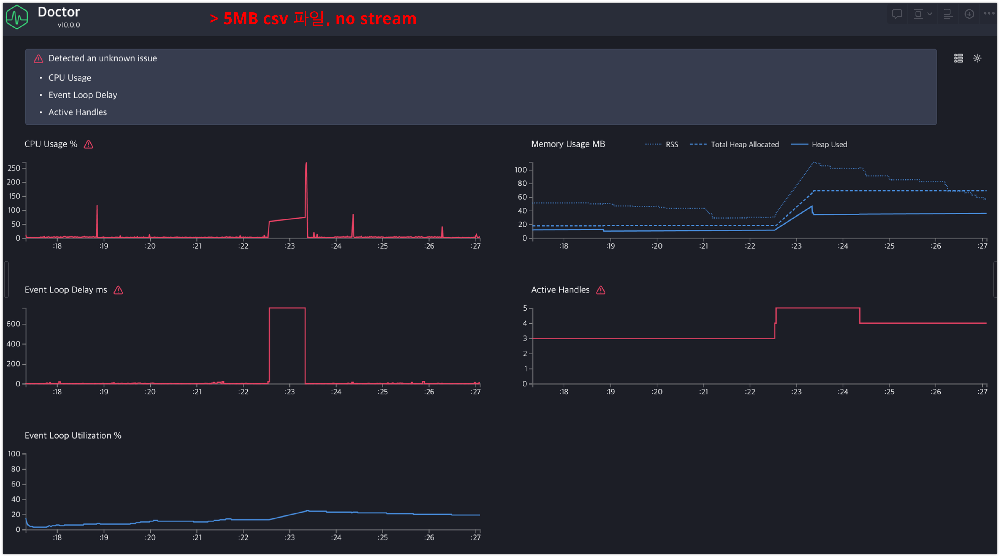
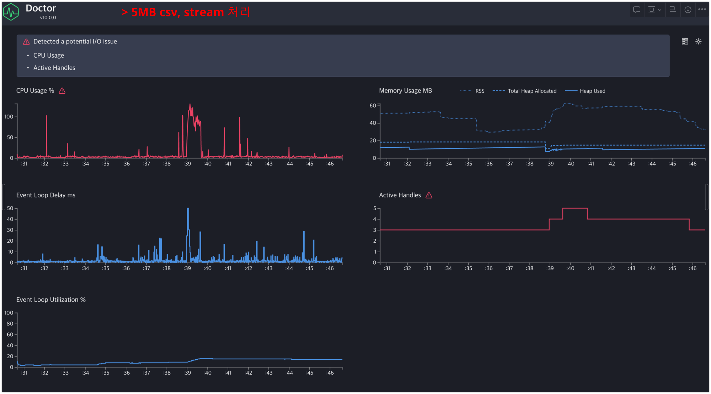
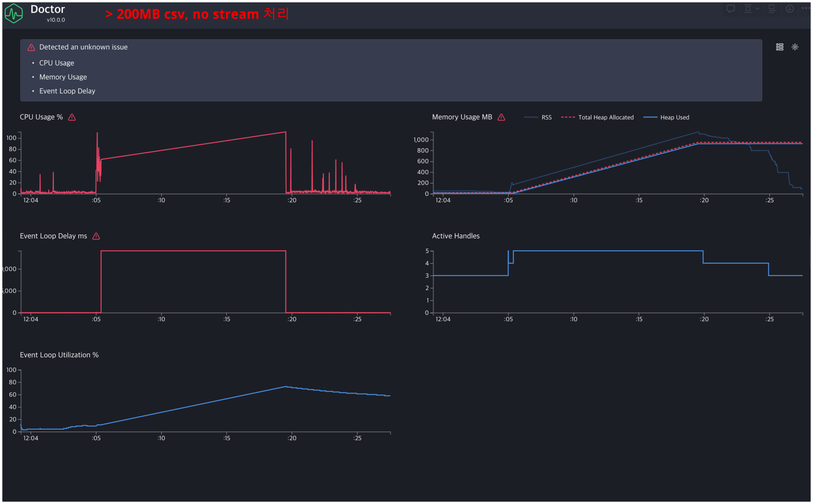
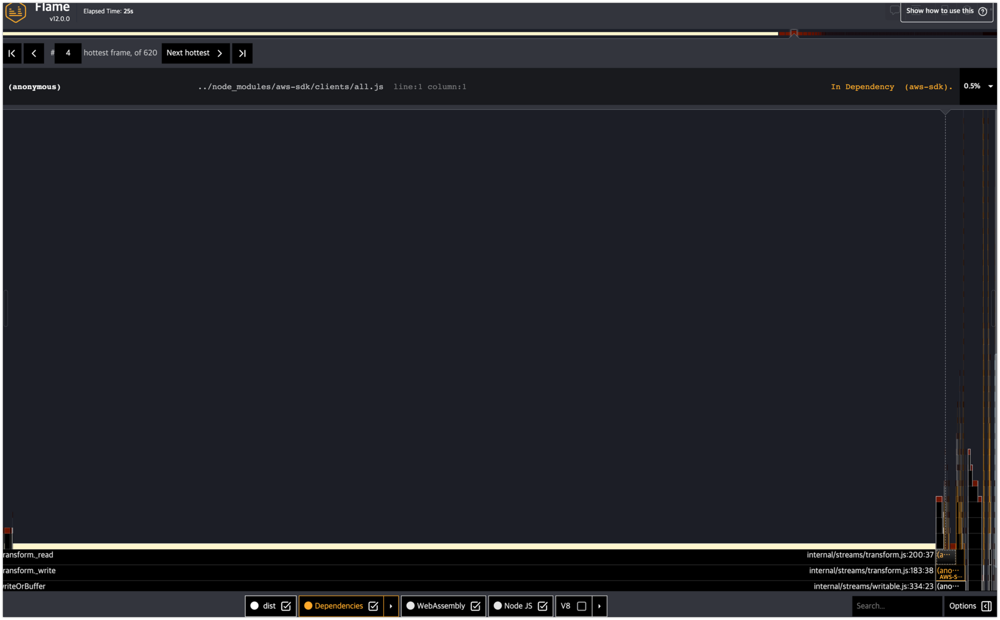
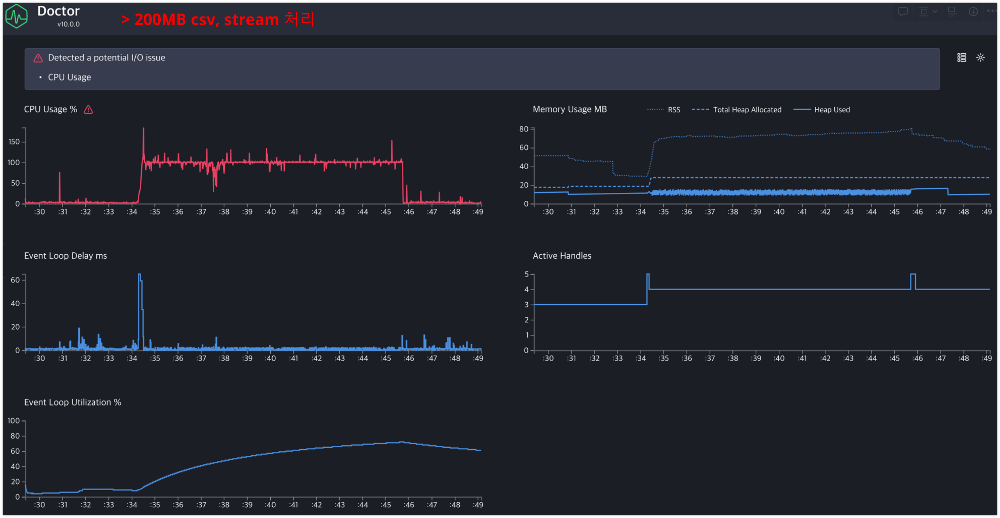
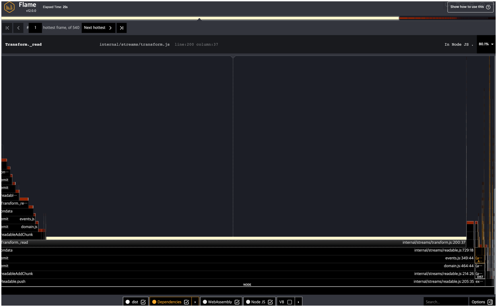

#  csv -> 필터링, 모니터링 -> ndjson 변환 -> s3 테스트 

## 5.4MB(50,000 row) csv 파일 테스트  

### reportService.execNoStream() 스트림 방식 X  

 

### reportService.execNoStream() 스트림 방식 O  

스트림 방식 적용한 경우, 이벤트 루프 딜레이가 줄어든 것 확인 가능  
 
 

## 200MB 이상(1,000,000 row 이상) csv 파일 테스트  

### reportService.execNoStream() 스트림 방식 X  

 

### reportService.execNoStream() 스트림 방식 O  

두 방식 모두 Transform._read 함수에서 가장 많은 CPU를 점유하는것은 동일하게 나타난다.
스트림 방식 적용한 경우, 이벤트 루프 딜레이가 줄어들고 메모리사용량이 일정하게 유지되는것 확인 됨. 
